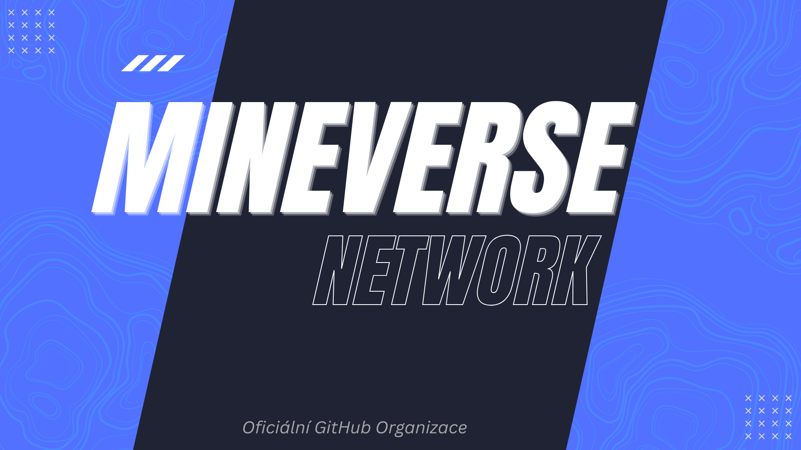

## 👋 Kdo jsme?

*Vítejte u nás na GitHubu! My jsme Mineverse, Minecraft server, který si zakládá především na kvalitě a originalitě. Náš server je zaměřený na propracovaný Fantasy RPG Factions. Pro co nejdokonalejší dosažení naší unikátní vize si v rámci možností vyvíjíme všechen potřebný software na míru. Zde se o tomto softwaru a naší infrastruktuře můžete dozvědět více.*

### 🚧 Server je ve vývoji 🚧

## ⚙️ Technologie, které používáme

#### Programovací Jazyky 

   

#### Frameworky

  

#### Ostatní

     

## 🌐 Infrastruktura

**Node #1** - *Minecraft servery & AI*
- 𝗖𝗣𝗨 ➔ AMD Ryzen 7 5700G 8 Jader 3.8 až 4.6 GHz 65W TDP
- 𝗚𝗣𝗨 ➔ Nvidia RTX 4060 Ti 16 GB
- 𝗥𝗔𝗠 ➔ 128 GB DDR4 3200 MHz Kingston Fury Beast
- 𝗦𝗦𝗗 ➔ 1 TB SSD M.2 NVMe WD Black SN770

**Node #2** - *Webové a ostatní služby + zálohy*
- 𝗖𝗣𝗨 ➔ `2x` Intel Xeon L5640 6 Jader 2.26 až 2.8 GHz 60W TDP
- 𝗥𝗔𝗠 ➔ 128 GB DDR3 ECC Registered 1600 MHz
- 𝗛𝗗𝗗 ➔ `4x` 2 TB SAS 7.2k RPM Dell Constellation (RAID 6)

## 💬 Kontakt
- **Web**: https://mineverse.cz
- **Discord**: https://discord.mineverse.cz (zatím pouze na individuální pozvání)
- **Email**: vedeni@mineverse.cz (odpověď maximálně do 48h)
- Nebo můžete přímo kontaktovat člena Vedení skrze Discord: `@marek_p`.
